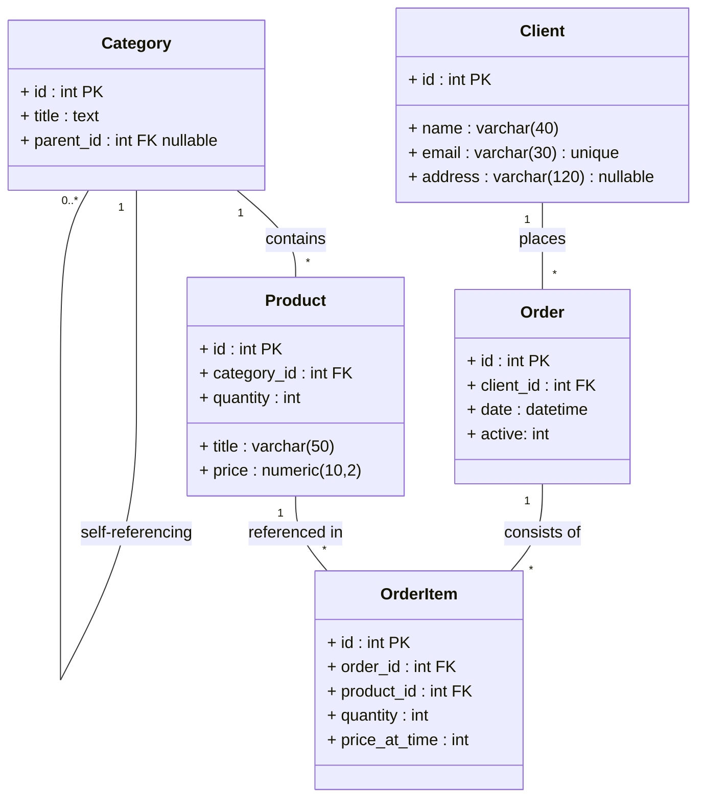

### Educational shop project REST, fastapi

### Stack
Fastapi, 
postgres,
Sqlalchemy,
Alembic,
Docker

### Database
В схеме данных предполагается, что может быть неограниченное количество категорий товаров, с вложенными подкатегориями.
У товара есть только одна категория-родитель. У категории верхнего уровня в качестве parent_id - null.

При добавлении новой подкатегории нужно указать ее parent_id, а после добавления её id можно указать в качестве родительского для каких-то других категорий. 

Аналогично, после удаления подкатегории у её дочерних подкатегорий нужно заменить parent_id.


Позиции заказа (order_item): Связь "многие-ко-многим" между заказами и товарами. Содержит id, ссылки на order_id и product_id, quantity и фиксированную price_at_time. 
В заказ можно добавить любой товар в количестве, которое в пределах того, что в наличии на складе.
В заказе не нужно дублирование товара: просто увеличивается количество quantity, если товара заказано несколько штук.




Проект MVP учебный. В более рабочих условиях рассматривается вариант использования ID не int, а uuid.
Логика может предположить, когда Order может становиться из active в оплаченный - не активный.


### Учебные задания

2.1. Sql Выбор имени клиента и общей суммы всех его заказов (если в заказе нет товаров, то сумма будет 0,
    если у клиента нет заказов, то он не будет в списке.)
```sql
SELECT client.name, coalesce(sum(order_item.quantity * order_item.price_at_time), 0::INTEGER) AS total_sum 
FROM client 
JOIN "order" 
ON client.id = "order".client_id 
LEFT OUTER JOIN order_item 
ON "order".id = order_item.order_id 
GROUP BY client.id, client.name;
```

2.2. Sql Количество подкатегорий первого уровня вложенности для каждой категории.
(сами товары product не считаем подкатегориями)
```sql
SELECT category.title, count(category_child.id) AS subcategories_count 
FROM category 
LEFT OUTER JOIN category AS category_child 
ON category_child.parent_id = category.id 
GROUP BY category.id, category.title 
ORDER BY category.id;
```

2.3. Sql 

2.3.1. Топ 5 количества проданных товаров за последний месяц,
Наименование товара, Категория верхнего уровня, Общее количество проданных штук.
```sql
with recursive category_hierarchy(child_id, parent_id, immediate_parent_id, level) as 
(
select
	category.id as child_id,
	category.id as parent_id,
	category.parent_id as immediate_parent_id,
	cast(0 as INTEGER) as level
from
	category
union all
select
	category_hierarchy.child_id as child_id,
	parent.id as parent_id,
	parent.parent_id as immediate_parent_id,
	category_hierarchy.level + 1 as level
from
	category_hierarchy
join category as parent on
	category_hierarchy.immediate_parent_id = parent.id
where
	category_hierarchy.immediate_parent_id is not null
)
select
	product.title as product_title,
	cparent.title as top_parent_title,
	sum(order_item.quantity) as total_quantity
from
	category_hierarchy
join product on
	product.category_id = category_hierarchy.child_id
join category as cparent on
	cparent.id = category_hierarchy.parent_id
join order_item on
	order_item.product_id = product.id
join "order" on
	order_item.order_id = "order".id
where
	category_hierarchy.immediate_parent_id is null
	and "order".date >= $1::TIMESTAMP with TIME zone
group by
	category_hierarchy.child_id,
	product.title,
	category_hierarchy.parent_id,
	cparent.title
order by
	sum(order_item.quantity) desc
limit 5

$1 : (пример даты «месяц назад» '2026-01-09 14:58:33.311319+00')

```

2.3.2. Для небольшого ускорения при запросе с условием сравнения "order.date >=" добавлен индекс на это поле.
- Для ускорения статистики можно добавить top_parent_id в таблицу category, но тогда его придется изменять у всех подкатегорий, если верхние категории будут меняться. 
- Для того, чтобы иерархию подкатегорий не вычислять каждый раз, можно создать материализованное представление или таблицу с предвычисленными данными, и обновлять её при изменении структуры категорий или по расписанию.
- Общее количество проданных товаров за месяц можно заранее вычислять и сохранять в отдельной таблице. Можно группировать это количество по дням или по календарному месяцу.
- Можно настроить триггеры/фоновые задачи для обновления данных о категориях или количестве проданных товаров.

    

### setup
- creating virtual environment, .env
- `uv install`

- `make run` or `python -m service`
- http://localhost:8000/docs/
- creating postgres db and app from docker-compose: `make up`
- Tests are planned for separated db: `test_db` with migrations.


### alembic:
Created 2 folders: for scema migration and for test data migration.
Mention `--head schema@head` for specifying folder.
In Makefile:
```
alembic-gen:
	alembic revision -m "edit" --head schema@head

alembic-up:
	alembic -c alembic.ini upgrade schema@head 

alembic-data:
	alembic -c alembic.ini upgrade data@head

alembic-down:
	alembic -c alembic.ini downgrade -1
```

-edit files configs:

`sqlalchemy.url = postgresql+asyncpg://%(DB_USERNAME)s:%(DB_PASSWORD)s@%(DB_HOST)s:%(DB_PORT)s/%(DB_NAME)s`

--
```
from starlette.config import Config

settingenv = Config(".env")
DB_NAME: str = settingenv("DB_NAME", cast=str)
DB_HOST: str = settingenv("DB_HOST", default="localhost", cast=str)
DB_USERNAME: str = settingenv("DB_USERNAME", cast=str)
DB_PORT: int = settingenv("DB_PORT", cast=str)
DB_PASSWORD: str = settingenv("DB_PASSWORD", cast=str)

config = context.config
section = config.config_ini_section

config.set_section_option(section, "DB_USERNAME", DB_USERNAME)
config.set_section_option(section, "DB_PASSWORD", DB_PASSWORD)
config.set_section_option(section, "DB_HOST", DB_HOST)
config.set_section_option(section, "DB_PORT", DB_PORT)
config.set_section_option(section, "DB_NAME", DB_NAME)

from service.db_setup.models import User, Base
target_metadata = Base.metadata
```


`alembic revision --autogenerate -m 'initial'`
